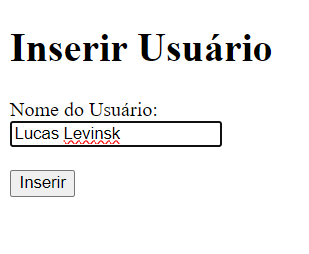
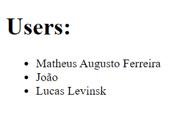
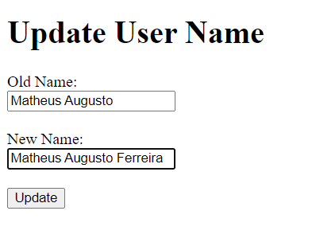
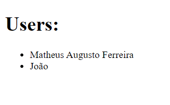
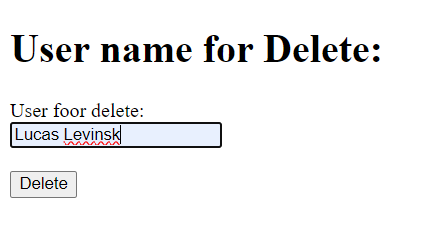
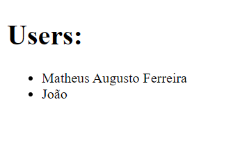

# CRUD básico na Micro Framework Flask

Estou iniciando meus estudos em flask, uma micro framework de python, ou seja algo não tão robusto, com maior flexibilidade na escolha de bibliotecas para desenvolvimento, usado para desenvolvimento web.

Neste projeto adicionei apenas as funcionalidades básicas CRUD para teste do meu conhecimento.

**Rota "/insert-form" renderiza um formulário para inserir um novo usuário, ao clicar em "submit" ele chama a função de inserir um novo usuário:**

Essa é a interação de adicionar um novo usuário:

**Resultado:**

**Rota "/getAll' Exibi todos os usuários criados:**

**Rota "/update-form" me permite trocar o nome de um usuário existente por outro nome, quando clico em "submit" ele chama o serviço de atualizar o nome e executa isso:**

Essa é a interação de trocar o nome:

**Esse foi o resultado:**

**Rota "/delete-form" me permite colocar o nome do usuário a ser deletado, quando clico em "submit" ele chama o método de deletar:**

Essa é a interação de escolher o nome a ser deletado:

**Resultado:**

**Desenvolvi em um servidor local mesmo somente para testes, usando o MySQL como banco de dados, utilizei a biblioteca _mysql.connector_ para realizar a conexão, espero que tenham gostado**

